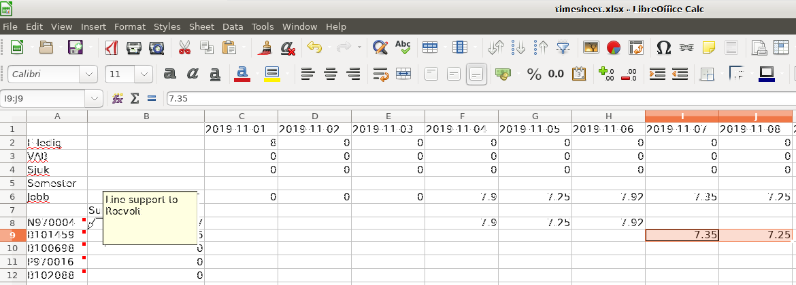

# Time report

The shell script *doTimesheet.sh* will call the python-script to generate an Excel-file based 
on one or more exported Timekey Period balances located in the input-path. To export period balance sheets, goto
[Timekey](https://timekey.epiroc.group/menu/#/app/home) and click the little printer symbol to export Period balance/Saldo.

Edit the script to fill in the project numbers you're currently working on and use the comments to get som indication on what those numbers refer to.
The script will automatically create formulas to sum up the total number of hours that are filled in on each row.

### Note
The script will look for parental leave, vacation, sick leave and hours of presence (currently in Swedish!) and convert to decimal hours.
Days are put as header row and hours found for every recognized type of hour will show up on a row below.
See example:

